# KUBERNETES
## Komponen-Komponen Kubernetes
### Komponen Master

Komponen master menyediakan control plane bagi klaster. Komponen ini berperan dalam proses pengambilan secara global pada klaster, serta berperan dalam proses deteksi serta pemberian respons terhadap events yang berlangsung di dalam klaster. Komponen master dapat dijalankan di mesin manapun yang ada di klaster, untuk memudahkan proses yang ada, script inisiasi awal yang dijalankan biasanya memulai komponen master pada mesin yang sama, serta tidak menjalankan kontainer bagi pengguna di mesin ini.

 ### Kube-apiserver

Komponen di master yang mengekspos API Kubernetes. Merupakan front-end dari kontrol plane Kubernetes. Komponen ini didesain agar dapat di-scale secara horizontal.
etcd

Penyimpanan key value konsisten yang digunakan sebagai penyimpanan data klaster Kubernetes.
kube-scheduler

Komponen di master yang bertugas mengamati pod yang baru dibuat dan belum di-assign ke suatu node dan kemudian akan memilih sebuah node dimana pod baru tersebut akan dijalankan.

Faktor-faktor yang diperhatikan dalam proses ini adalah kebutuhan resource secara individual dan kolektif, konstrain perangkat keras/perangkat lunak/peraturan, spesifikasi afinitas dan non-afinitas, lokalisasi data, interferensi inter-workload dan deadlines.

### kube-controller-manager

Komponen di master yang menjalankan kontroler.

Secara logis, setiap kontroler adalah sebuah proses yang berbeda, tetapi untuk mengurangi kompleksitas, kontroler-kontroler ini dikompilasi menjadi sebuah binary yang dijalankan sebagai satu proses. Kontroler-kontroler ini meliputi:

    Kontroler Node : Bertanggung jawab untuk mengamati dan memberikan respons apabila jumlah node berkurang.
    Kontroler Replikasi : Bertanggung jawab untuk menjaga jumlah pod agar jumlahnya sesuai dengan kebutuhan setiap objek kontroler replikasi yang ada di sistem.
    Kontroler Endpoints : Menginisiasi objek Endpoints (yang merupakan gabungan Pods dan Services).
    Kontroler Service Account & Token: Membuat akun dan akses token API standar untuk setiap namespaces yang dibuat

pertama buka [https://kubernetes.io/docs/tutorials/hello-minikube/](https://kubernetes.io/docs/tutorials/hello-minikube/)  dan berhubung binggung kita mulai dari membuat docker image seperti foto di bawah
## membuat docker image
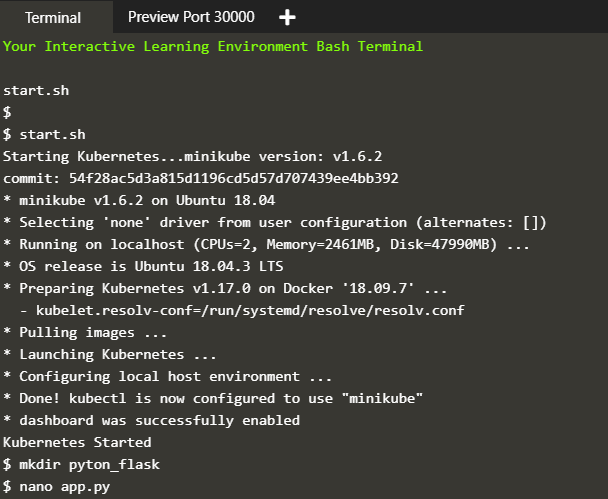
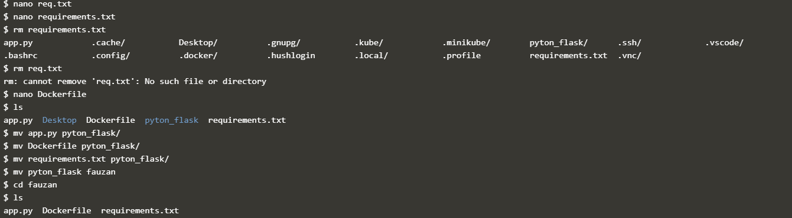
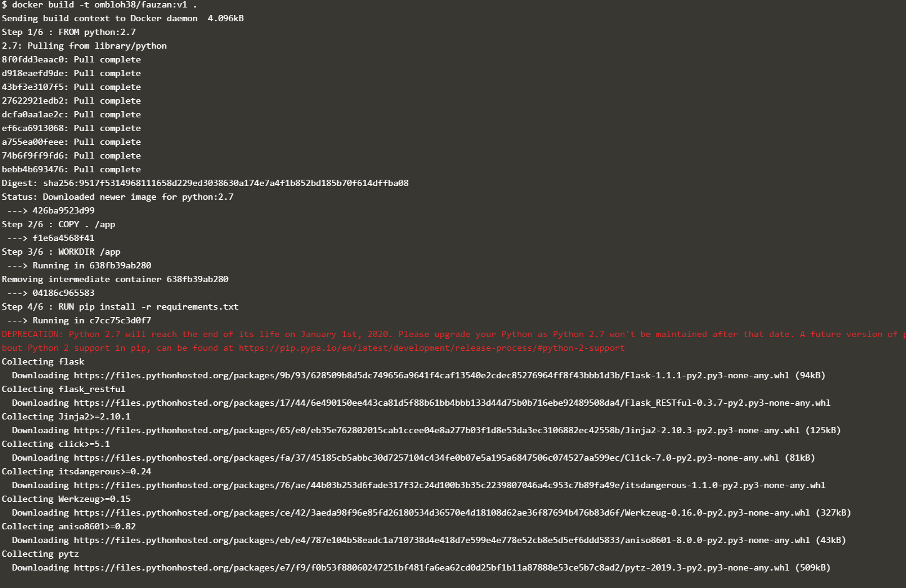
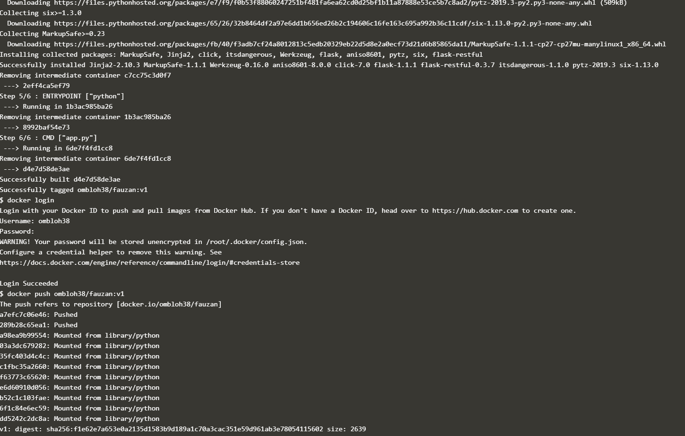
1.   Membuat deployment untuk image pyton-flask
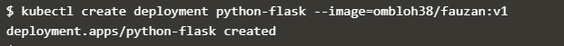
2. Melihat Deployment yang telah dibuat
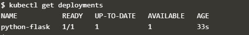
3.  melihat pods yang di buat
 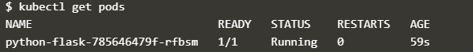
 4. Melihat event yang terjadi pada cluster
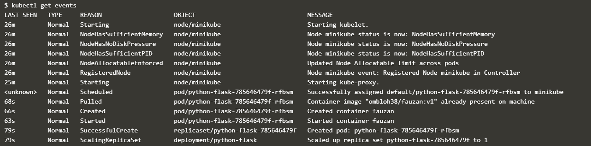

## membuat sebuah service

1. mengekspos pods yang telah di buat
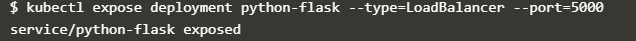
 2. melihat service yang dibuat
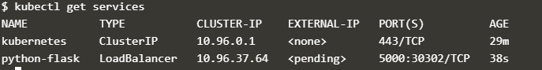 
 4. akses browser
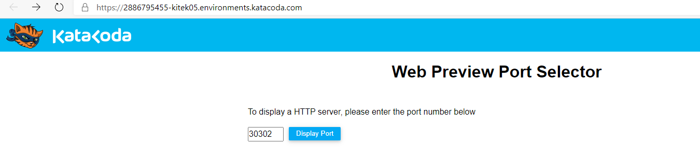 
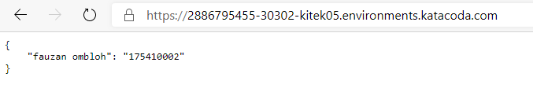 